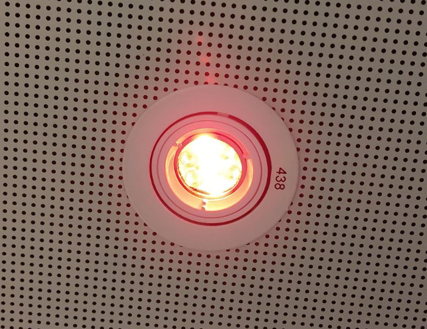
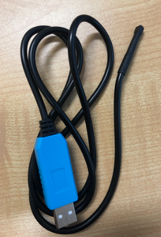

```
 ___    _____   _     _       _     _   _             
|_ _|__|_   _| | |   (_) __ _| |__ | |_(_)_ __   __ _ 
 | |/ _ \| |   | |   | |/ _` | '_ \| __| | '_ \ / _` |
 | | (_) | |   | |___| | (_| | | | | |_| | | | | (_| |
|___\___/|_|   |_____|_|\__, |_| |_|\__|_|_| |_|\__, |
                        |___/                   |___/ 
```

In this lab, we will learn how to control the lab lighting using a computer. This should reveal some of the amazing possibilities of the IoT, as well as some of the potential for misuse if security is not handled correctly. We will learn about this while playing with a little bash scripting on Ubuntu Linux. We will briefly chat about:
* The Internet of Things (IoT)
* Linux
* Security
* Coding
* Machine to Machine Communications 

<div style="float: right; width: 200px; margin: 0 10px 10px 0;">
  
  <p style="text-align: center;">The light you will turn on. Please note the location of the fixture number, but remember to use your own</p>
</div>

<div style="float: right; width: 200px; margin: 0 10px 10px 0;">
  
  <p style="text-align: center;">When you execute the command correctly, the light should turn on</p>
</div>

## Turning the lights on and off ##

The lab you are sitting in contains network-accessible lighting. Look directly above you and make a note of the FIXTURE NUMBER noted one your light. Note the command provided below.

	curl -i -X PUT -H 'Content-Type: application/json' -d '{"target": "fixture","num": '''FIXTURENUMBER''',"intensity": '''255''',"red": '''255''',"green": '''0''',"blue": '''0''',"temperature": '''255''',"fade": '''1.0''',"path": "Default"}' http://10.50.41.230/api/override

Copy the line above into a text editor, and then change the '''FIXTURENUMBER''' to the light found on your computer overhead. Once you have edited this in a text editor, Open a terminal, the black box on the side of your Desktop. Copy and paste the edited command from your text editor into the terminal. Did your light turn on? What was the colour? Change the values to change the light to your favourite colour.

How do you think you could switch the light off? Play with the parameters and ask for help if you need some guidance.

## Some Basic Bash Programming ## 

This section will introduce you to looping in bash. Open a new text editor window and paste in the following code.

```
#!/bin/bash

for i in {1..5}
do
  echo "Hello World!"
  sleep 1s
done
```

Save the file as:
 
	lighting.sh 

Then ensure that the file has execute permissions by typing the following into your terminal window:

 	chmod 777 lighting.sh

Then run the program in the terminal with the following command:

 	sudo ./lighting.sh

'''hint:''' the password is student

Press Ctrl+C to stop the program when you have seen enough hello worlds.

#### Tasks ####
* Can you modify the program to print ten Hello worlds?
* Can you modify the program to see if you can turn the light on and off every second? 
* After you have done this, can you modify the program to change the colour every second?

## Measuring the sensors temperature ##

We are going to measure the temperature of the sensor.

	sudo temp

'''hint:''' the password is student

Write down the sensor temperature (not touching the sensor).
Read the following code and see if you can work out what is going on. Open a new file, paste the code below and save it as temperature_visualisation.sh

```
#!/bin/bash

temp=$(temp)
echo $temp
```

When you update your code, you will now need to run the code with sudo, so that the code is running with the privileges required to access the temperature probe.

	sudo ./lighting.sh

#### Tasks ####
* Use your knowledge of looping from the previous section to continually check and print the temperature for 2 minutes.
* See if you can integrate the line below to show this in Fahrenheit:
	temp#$((temp * 9/5 + 32))

## Using your hands to warm the sensor up ##

<div style="float: right; width: 100px; margin: 0 10px 10px 0;">
  
  <p style="text-align: center;">Temperature Sensor</p>
</div>

#### Tasks ####
* Where do you think the sensor is on the cable?
* Can you see the temperature go up when you touch it?
* How warm can you get it?


## If statements ##

Computer programs can take different actions/paths based on circumstances. Run the following code:

```
#!/bin/bash

temp=$(temp)
echo $temp

if [ $temp -gt 26 ]
then
 echo "Its really hot"
elif [ $temp -gt 25 ]
then
 echo "Its sorta warm"
elif [ $temp -gt 24 ]
then
 echo "Its coolish "
elif [ $temp -gt 23 ]
then
 echo "Its cool"
else
 echo "Dunno"
fi
```

You can change/test the temperature of the sensor by holding the sensor or leaving it alone to cool down.

#### Challenging Tasks ####
* Can you modify the code to change to a different colour based on the temperature, you can also play with the fade?
* Can you then loop over this code block for 10 minutes or 600 seconds, it may be helpful to use the sleep command again and retest the temperature every second?
* Can you change more than just your own light?

