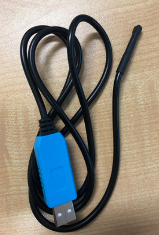

```
 ___    _____   _     _       _     _   _             
|_ _|__|_   _| | |   (_) __ _| |__ | |_(_)_ __   __ _ 
 | |/ _ \| |   | |   | |/ _` | '_ \| __| | '_ \ / _` |
 | | (_) | |   | |___| | (_| | | | | |_| | | | | (_| |
|___\___/|_|   |_____|_|\__, |_| |_|\__|_|_| |_|\__, |
                        |___/                   |___/ 
```

In this lab, you will learn how to control the physical world using a computer! We will turn the lab lights on and off using code, read the temperature of a sensor, and make the lights react to the room's temperature. 

Along the way, we will briefly chat about:
* **The Internet of Things (IoT)** 
* **Linux** 
* **Security**
* **Coding**
* **Machine to Machine Communications** 

---

## Getting Started: The Terminal

Throughout this lab, we will be using the **Terminal**. Instead of clicking on icons with a mouse, the terminal allows us to type text commands to tell the computer exactly what to do. It might look like a hacker tool from a movie, but it's just another way to communicate with your computer!

**How to open the Terminal:**
Look at the left side of your screen for a black rectangle icon. Click it. (You can also press `Ctrl + Alt + T` on your keyboard). A black or purple box with a cursor will pop up.

**Important Terminal Rules for Beginners:**
* **Press `Enter` to run:** The computer doesn't do anything until you press the `Enter` key.
* **Copy and Paste is different:** In the terminal, `Ctrl + V` does not work! To paste text, **Right-click** and select "Paste", or press `Ctrl + Shift + V`.
* **Spelling and spacing matter:** Computers are literal. If a command has a space, you need the space. If it has a capital letter, you need the capital.
* **The "Magic Stop" button:** If you ever run a program and it won't stop, or you make a mistake and the terminal gets stuck, press `Ctrl + C`. This tells the computer to "Cancel" or stop whatever it is doing immediately.

---

## Getting Started: The Nano (Your Text Editor)

Throughout this lab, we will write our code using **nano**, a simple text editor that runs right inside your terminal. Here are the only things you need to know:
* **To open a file:** Type `nano filename.sh` and press Enter.
* **To paste code:** Right-click inside the terminal and select "Paste" (or press `Ctrl + Shift + V`).
* **To save a file:** Press `Ctrl + O` (the letter O, not zero), then press `Enter` to confirm the file name.
* **To exit nano:** Press `Ctrl + X`. 

*(💡 Notice the menu at the bottom of the nano screen? The `^` symbol means the `Ctrl` key. So `^O WriteOut` means `Ctrl + O` to save).*

---

<div style="float: right; width: 200px; margin: 0 10px 10px 0;">
  
  <p style="text-align: center;">The light you will turn on. Please note the location of the fixture number, but remember to use your own</p>
</div>

<div style="float: right; width: 200px; margin: 0 10px 10px 0;">
  
  <p style="text-align: center;">When you execute the command correctly, the light should turn on</p>
</div>

## Part 1: Turning the lights on and off

The lab you are sitting in contains network-accessible lighting. You are going to send a message over the network to tell your light to turn on.


### Step 1: Find your Fixture Number
Look directly above you at the light fixture. There is a number written on it. **Write this number down** - this is your `FIXTURENUMBER`. 

### Step 2: Edit your command
Below is the "command" we will send to the light. It is written in a format called JSON (a popular way to format messages for the web). 

```bash
curl -i -X PUT -H 'Content-Type: application/json' -d '{
	"target": "fixture",
	"num": "FIXTURENUMBER",
	"intensity": "255",
	"red": "255",
	"green": "0",
	"blue": "0",
	"temperature": "255",
	"fade": "1.0",
	"path": "Default"
}' http://10.50.41.230/api/override
```

1. Open your terminal and type `nano mylight.sh` and press Enter. You are now inside the text editor!
2. Copy the block of code above, and right-click inside the terminal to paste it.
3. Use your arrow keys to navigate to the word `FIXTURENUMBER` and delete it. Type your actual fixture number in its place. 
4. Save the file by pressing `Ctrl + O`, then press `Enter`. 
5. Exit nano by pressing `Ctrl + X`. 

*(💡 **What is this code doing?** `curl` is a tool that sends messages across a network. We are sending a message to the light's controller "address" (`http://10.50.41.230/...`) telling it to turn on. The numbers control the color: Red is 255, Green is 0, and Blue is 0. In computers, colors mix like light, so 255 red + 0 green + 0 blue = Pure Red!)*

### Step 3: Run the command
To run the instructions you just saved, type the following into your terminal and press Enter:
```bash
sudo bash mylight.sh
```

> ⚠️ **CRITICAL NOTE ABOUT PASSWORDS!** 
> When you type the password (`student`), **nothing will show up on the screen**—no dots, no stars, nothing! This is a normal security feature in Linux so people looking over your shoulder can't see how long your password is. Just slowly type `student` and press `Enter`. It *is* working, even though you can't see it!

Did your light turn on? What colour was it? Red? 

### Step 4: Play with the colours
Let's change the colour! In your terminal, type `nano mylight.sh` to open your file again. Change the color numbers. Try making Purple (`"red": "255", "green": "0", "blue": "255"`). Save (`Ctrl+O`, `Enter`) and exit (`Ctrl+X`). Run it again with `sudo bash mylight.sh`.

> **🤔 How do you turn the light off?** 
> Look at the `"intensity"` parameter. Intensity means brightness. `255` is maximum brightness. What do you think the number should be for zero brightness (off)? Open your file, change that number, and run it again to turn your light off.

---

## Part 2: Basic Bash Programming

Typing commands one at a time is slow. Let's write a **script**—a text file that contains a list of commands for the computer to run automatically. The language we are using is called **Bash**.

1. In your terminal, type `nano lighting.sh` and press Enter.
2. Paste in the following code:

```bash
#!/bin/bash
for i in {1..5}
do
  echo "Hello World!"
  sleep 1s
done
```

*(💡 **What is this code doing?** `for i in {1..5}` creates a loop that counts from 1 to 5. `echo` prints text to the screen. `sleep 1s` tells the computer to wait for 1 second. So, this script says "Print Hello World, wait 1 second, and do that 5 times."*) 

3. Save the file (`Ctrl + O`, `Enter`) and exit (`Ctrl + X`).

### Make the script runnable
Before a script can be run directly, we have to tell the computer it is allowed to execute it. 
In your Terminal, type the following command and press Enter:
```bash
chmod 777 lighting.sh
```
*(💡 **What is `chmod`?** It stands for "Change Mode". 777 is a code that says "anyone can read/write/run this file".)*

### Run the script
To run your script, type this into your terminal and press Enter:
```bash
sudo ./lighting.sh
```
*(Remember: Type `student` for the password even though you can't see it!)*

Press `Ctrl + C` in your terminal to stop the program if it gets stuck or you've seen enough Hello Worlds.

### Tasks
* **Task 1:** Can you modify the program to print ten Hello Worlds instead of five? *(Hint: `nano lighting.sh`, change the `{1..5}` part, save, exit, and run it again).*
* **Task 2:** Can you replace the `echo "Hello World!"` line with the `curl` command you used in Part 1 to turn your light on? Add a `sleep 1s` after it. Then, copy the `curl` command again, but change it to turn the light off. Loop it so the light blinks on and off!
* **Task 3:** Can you modify the loop to change the colour of the light every second?

---
<div style="float: right; width: 100px; margin: 0 10px 10px 0;">
  
  <p style="text-align: center;">Temperature Sensor</p>
</div>

## Part 3: Measuring the Sensor Temperature

Let's switch gears from lights to sensors. We have a temperature sensor connected to your computer. 

1. In your terminal, type the following and press Enter:
   ```bash
   sudo temp
   ```

Write down the temperature it shows you. **Do not touch the sensor yet!**

Now, let's write a script to save this temperature so we can use it in our code. 
1. Type `nano temperature_visualisation.sh` and press Enter.
2. Paste the code below:

```bash
#!/bin/bash
current_temp=$(temp)
echo $current_temp
```

*(💡 **What is this code doing?** The `$(temp)` part runs the temp command and captures whatever number it spits out. We store that number in a variable named `current_temp`. The next line simply prints it to the screen.)*

3. Save (`Ctrl + O`, `Enter`) and exit (`Ctrl + X`).

Run your new script:
```bash
sudo ./temperature_visualisation.sh
```

### Tasks
* **Task 1:** Use your knowledge of looping from Part 2 to continually check and print the temperature for 2 minutes (120 seconds). 
* **Task 2:** Let's convert it to Fahrenheit! Open your script (`nano temperature_visualisation.sh`). Right after the `current_temp=$(temp)` line, add this math equation:
  ```bash
  current_temp=$((current_temp*9/5+32))
  ```
  Save, exit, and run your script again. Does the Fahrenheit number look right?

---

## Part 4: Using your hands to warm the sensor up

### Tasks
* **Task 1:** Look at the temperature sensor cable. Where do you think the actual sensor is on the cable? (It's usually a small bulge or metal tip).
* **Task 2:** While running your 2-minute temperature loop, hold the sensor between your fingers. Can you see the temperature go up on your terminal?
* **Task 3:** How warm can you get it?

---

## Part 5: If Statements (Making Decisions)

Computer programs can take different actions based on circumstances. This is called an "If Statement". 

1. Type `nano decisions.sh` and press Enter.
2. Paste the following code:

```bash
#!/bin/bash
current_temp=$(temp)
echo $current_temp

if [ $current_temp -gt 26 ]
then
 echo "Its really hot"
elif [ $current_temp -gt 25 ]
then
 echo "Its sorta warm"
elif [ $current_temp -gt 24 ]
then
 echo "Its coolish"
elif [ $current_temp -gt 23 ]
then
 echo "Its cool"
else
 echo "Dunno"
fi
```

*(💡 **What is this code doing?** It checks the temperature (`-gt` means "Greater Than"). If it is greater than 26, it prints "Its really hot". If it isn't, it moves to the next check (`elif`), and so on.)*

3. Save (`Ctrl + O`, `Enter`) and exit (`Ctrl + X`).

Make it executable: `chmod 777 decisions.sh`

Run it with `sudo ./decisions.sh`. Try holding the sensor to make it warmer, then let it cool down, and run it again to see the different messages.

### Challenging Tasks (Combine everything you've learned!)
* **Task 1:** Can you modify the code to change your light to a different colour based on the temperature? *(Hint: `nano decisions.sh`. Replace the `echo` lines with your `curl` commands from Part 1. Make Red for hot, Blue for cold!)*
* **Task 2:** Can you wrap this entire `if` statement inside a `for` or `while` loop so that it continuously checks the temperature and updates the light for 60 seconds?
* **Task 3 (Hacker Challenge):** Look at your `curl` command. It says `"target": "fixture"` and `"num": "FIXTURENUMBER"`. What happens if you put your neighbor's fixture number in your code instead of yours? Can you change more than just your own light? *(Note: This is exactly why IoT security is so important! If these lights weren't secured properly, anyone on the internet could do this).*
