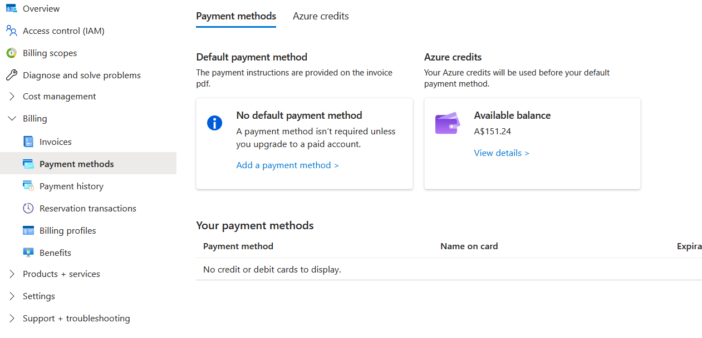
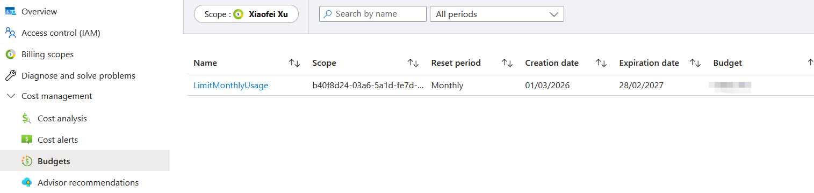
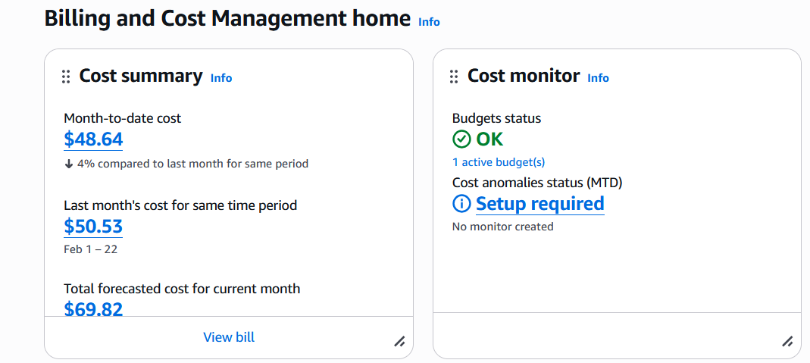
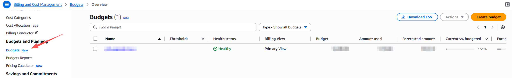

```
  ____                _        __   __
 / ___|_ __ ___  __ _| |_ ___  \ \ / /__  _   _ _ __
| |   | '__/ _ \/ _` | __/ _ \  \ V / _ \| | | | '__|
| |___| | |  __/ (_| | ||  __/   | | (_) | |_| | |
 \____|_|  \___|\__,_|\__\___|   |_|\___/ \__,_|_|

  ____ _                 _   ____
 / ___| | ___  _   _  __| | / ___|  ___ _ ____   _____ _ __
| |   | |/ _ \| | | |/ _` | \___ \ / _ \ '__\ \ / / _ \ '__|
| |___| | (_) | |_| | (_| |  ___) |  __/ |   \ V /  __/ |
 \____|_|\___/ \__,_|\__,_| |____/ \___|_|    \_/ \___|_|
                                                             
```


This lab will introduce you to create your own cloud server. By the end of this lab you will have a virtual machine running at a location of your choosing and serving files via an Nginx web server. In subsequent weeks we will link this virtual machine to DNS.

Note that this lab is designed around using Azure Virtual Machine or AWS EC2 services, but you are not restricted to this choice at all. Just like we encourage studnets to try VirtualBox and Vmware, you are encouraged to compare and choose between: 
* [AWS EC2](https://aws.amazon.com/ec2/)
* [AWS Lightsail](https://aws.amazon.com/lightsail/)
* [Microsoft Azure](https://portal.azure.com/)
* [Digital Ocean](https://www.digitalocean.com/)
* [Vultr](https://www.vultr.com/)
* [Binary Lane](https://www.binarylane.com.au/)


This lab assumes that you have viewed the weekly videos and that you have an account with Azure or AWS. The easiest way to get start might be using [Azure for Students](https://azure.microsoft.com/en-us/free/students) and register using your student email account. This will give you some credit to run your virtual machine for this unit without requiring a credit card. If you prefer to use AWS, you can register for AWS's free tier which will require a credit card. 

The lab is written around you using your Linux VM that are running, or the lab machines, but it should work just fine on MacOS or Windows. Just like Linux, you will need to ensure that you are executing your ssh commands in the same directory as the .pem file that you download from Azure/AWS.

**If you prefer to follow the instructions mentioned in this lab, please choose either Azure or AWS, you don't need to do both.**

**You can go with "Creating a Virtual Machine in Azure " -> "Install Nginx" and the rest of the lab**

**OR**

**You can go with "Creating a Virtual Machine in AWS " -> "Install Nginx" and the rest of the lab**

**If you are comfortable with trying other providers, feel free to use other IaaS providers on the market.**

## Creating a Virtual Machine in Azure ##

### Log in to the Azure Console ###

To start the lab, log into the Azure management console: https://portal.azure.com/

For the purposes of the signup for student subscription, please use your Murdoch email to register. Here is the link for [Azure for Students](https://azure.microsoft.com/en-us/free/students).

### Launch an Ubuntu Machine in Azure ###
* Search for Virtual Machines.
* Create a virtual machine.
* Follow the steps on the Azure site. 
* Subscription - To use student free credit, please select "Azure for Students".
* Resource group - Give it a name like "Web Server Resource Group".
* Virtual machine name - Give it a meaningful name so that you can easily identify later. 
* Region - Pick up one from the recommended region. The one close to us would be "Australia East".
* Availability zone - You don't need to change it unless the VM size you wanted is not available at this zone. At the moment you can leave it as the default.
* Most of the configuration not mentioned can be leave as the default. 
* Image - Pick "Ubuntu Server 24.04 LTS".
* Size - **Very Important**, this relates to the resource you got and the price you will be paid for the computational power for the VM. "B-Serues" VM should be the most budget-friendly size in Azure, try to pick a "B-Serues" size. If you cannot find it, try switch to another zone and region. 
* Create a new "key pair" and set the username.  By default, Azure uses key files rather than a username and password to verify your identity when logging into your virtual machine.  If you lose this file it is unlikely you will be able to mange your virtual machine so it is important to keep it safe.  Give it a meaningful name like "webserver-key" so that you can identify it later.
* Configure Inbound port rules
*  There is an existing SSH permission that is needed to manage your remote server, that is fine.
*  Click "Select inbound ports" and select HTTP (80) as the type.  This allows web requests to be received by our server.
* There may be a warning that your server is "open to the world".  That's fine, we are building a public webserver!
* Configure disks - The default is to create a virtual machine with an 30GB OS disk. That's fine, leave it at the default. Please note, the OS disk type comes with different prices, if you prefer to lower your cost, you can try other options in OS disk type. 
* Configure networking - The default is to create a virtual subnet plus assign a public IP. That's fine, leave it at the default. 
* Add management, monitoring and tag configuration - There is no need to add those configuration at the moment. So continue to "Review + create".
* Launch Instance - Click on "Create" and your server will start. After this you can use "Notifications" to monitor it's progress.

### Console Access to the Virtual Machine ###
Now that your server is running in the cloud you need to login to the command line of your virtual machine. If you select your virtual machine and click the "connect" button. Then click on SSH client and note the string provided. 

Open Powershell, the Linux command line or the MacOS terminal on yur device. Then use 'cd' to move to the directory where you downloaded your key. Then you can paste the string that was provided to you above. It shuold look something like: 

    ssh -i "yourkeyname.pem" your_username@your_azure_vm_ip_address

You should now have SSH access to your cloud machine. Feel free to continue with "Install Nginx".


## Creating a Virtual Machine in AWS ##

### Log in to the AWS EC2 Management Console ###

To start the lab, log into the AWS EC2 management console: http://aws.amazon.com/ec2/

For the purposes of the signup, being a Business or School and using your Murdoch email has had reports of the fewest delays with credit card checks.

### Launch an Ubuntu Machine in EC2 ###
* Launch a new instance (virtual machine).
* Follow the steps on the AWS site. 
* Add Name and tags - Please give your meaningful name so that you can identify them easily. There is no need to add any tags so continue to "Application and OS images".
* Application and OS images - Pick a "free tier eligible" Ubuntu 24.04 LTS Instance.
* Configure the instance details - You can leave everything as the default.
* Create a new "key pair".  AWS uses key files rather than a username and password to verify your identity when logging into your virtual machine.  If you lose this file it is unlikely you will be able to mange your virtual machine so it is important to keep it safe.  Give it a meaningful name like "webserver-key" so that you can identify it later. You will get something like "webserver-key.pem".
* Configure Network Settings - Click edit. 
* For the network setting, leave it as the default should be fine. 
* For Firewall, select create security group.
* Security group name - Call it "ssh-and-web"
* There is an existing SSH permission that is needed to manage your remote server, that is fine.
*  Click "Add Rule" and select HTTP (web) as the type.  This allows web requests to be received by our server.
* There may be a warning that your server is "open to the world".  That's fine, we are building a public webserver!
* Add storage - The default is to create a virtual machine with an 8GB hard drive. That's fine, leave it at the default.
* Launch Instance - If you are happy with the configuration, Click on "Launch Instance" and your server will start. After this you can use "View Instance" to monitor it's progress.

### Console Access to the Virtual Machine ###
Now that your server is running in the cloud you need to login to the command line of your virtual machine. If you select your virtual machine and click the "connect" button. Then click on SSH client and note the string provided. 

Open Powershell, the Linux command line or the MacOS terminal on yur device. Then use 'cd' to move to the directory where you downloaded your key. Then you can paste the string that was provided to you above. It shuold look something like: 

    ssh -i "yourkeyname.pem" ubuntu@your_ec2_public_dns_or_IP

You should now have SSH access to your cloud machine. Feel free to continue with "Install Nginx".

## Install Nginx ##

Once you have command-line access to your virtual machine, the apt repositories may be out of date. Before you install anything, it is often a good idea to update them with 

	sudo apt update

Install the Nginx Web Server using:

	sudo apt install nginx-full

Test by visiting your new webserver. On your machine sitting in front of you, you should be able to type the your cloud virtual machine's IP into your web browser.

## Edit index.html on the Webserver and test ##

Once the machine has been launched, try to create /var/www/html/index.html with

	nano /var/www/html/index.html

If you get permission problems with this command, think carefully about the best approach to editing it.

This will ensure that your page is unique. Browse to your web page using a web browser to ensure it is working. You can find the Public IP address of your webserver on the management page of your cloud virtual machine.

Paste that IP address, with http:// before the IP address into your browser. Note that modern browsers will try to force https:// so you will need to ensure that you are actually visiting the http site.

## Linking to files from your webserver ##

Now that we are building confidence with editing our index.html, we are going to push the boundaries a bit an link to some actual files. You can download files from the Internet straight to your machine in the cloud with wget.

As an example try:
	
	wget http://www.eecs.berkeley.edu/Pubs/TechRpts/2009/EECS-2009-28.pdf

This command should download the weekly reading into your /home/your_username directory. You would then need to move it into the /var/www/html directory using sudo. Try: 

	sudo cp EECS-2009-28.pdf /var/www/html/

Now we can try to access that pdf file remotely via a web browser. You will need to add that file name preciscely to the end of your website string.

If you have difficulties accessing the file via a browser, here are some potential issues:
* At times Nginx has changed the default directory from which it serves HTML.  /var/www or /var/www/html are common.  One way to find out where the files are being served from is to locate the existing "index.nginx-debian.html" file and place your files in the same directory.
* Rights and ownership can also be an issue.
	* Some Nginx installs require the owner to be the user www-data.
	* Check that there are Read rights to the file.

## Create Links in index.html ##

Once these files have been uploaded, you should create a link to the file by modifying the HTML in index.html. You can insert the following html into index.html as an example of how to create hyper-links to files. 

	<a href="filename.pdf">Click here</a>

You should ensure that the path for your pdfs matches the path that is shown below. Hint - you may need to add a directory and move some files around. Hints:

	mkdir
	mv

## Test ##

Test your configuration. Get your lab partner to try to download one of your files. Alternately, try downloading a file via your smartphone or laptop. Again, be careful to ensure that you are accessing the http page and not the https page. We will do https next week.

Once you have done this successfully, congratulations! You can now access any of the files you uploaded from anywhere in the world. Please do be aware that the web page you have created is not secure and any materials that you upload onto that webpage can be viewed by anyone.

## Budgets and Costs - Super Important! ##

If you won't be using your instance anymore, you may wish to shut it down or terminate (delete) it to decrease the chances of inadvertently running multiple instances and incurring cloud virtual machine usage charges. It is easy to launch instances in different countries and not notice them running. Remember that cloud-based services are often billed on the run-time of your server.  Be particularly careful if you launch an expensive instance featuring large memory, fast CPUs or GPU processors. 

For Azure, you may want to "Search for Cost Management and Billing, click Billing, then Payment methods". You will found your available balance of your existing Azure for Students credit. 



You will also want to set a budget, with an alert as well. To get started ''Search for Cost Management and Billing, click Cost management, then click on Budgets''. Try to find your current budget setting like in the following image. To create a new budget, click Add, then follow the text description on AWS to setup a budget with alerts. 




For AWS, at the most simple level, you want to ''click on your name in EC2 and go to My Billing Dashboard''. See the image here. You should be able to reconcile the costs that you see here.



You will also want to set a budget, with an alert as well. To get started ''click on your name in EC2 and go to My Billing Dashboard'' then look for the AWS budgets link, as indicated in the following image. Then follow the text description on AWS to setup a budget with alerts. 



If you encounter a random shutdown of your cloud VM, you might created a type of VM instance called a spot instance. For Azure and AWS, they all provide such type of VM intance: [Azure's spot VM](https://azure.microsoft.com/en-us/products/virtual-machines/spot), [AWS's spot VM](https://docs.aws.amazon.com/AWSEC2/latest/UserGuide/using-spot-instances.html). Spot VM instance will have a much lower cost than on-demand VM instances, but it requires your application is flexible to interruptions and it not suitable for regular website hosting. The common usage would be running data analysis programs or batch jobs. 

## Challenges ##

### Challenge 1 ###

*Try pinging some servers in different parts of the world. Look at the round trip time or latency. Does it match up with your expectations?
*What are some alternatives to Azure VM or AWS EC2?

### Challenge 2 ###

If you have local files on your Linux machine then you can move them onto the webserver with the following command:

	scp -i your_pem.pem file_to_upload your_username@[dns_entry_or_IP_address]:/home/your_username

This command will move file_to_upload into /home/your_username. Remember that SCP or Secure Copy is using the SSH port (22) to copy files. Once the file has been transferred to /home/your_username you can then move the file to /var/www/html/

### Challenge 3 ###

Learn some basic HTML and try to create your own index.html page.

