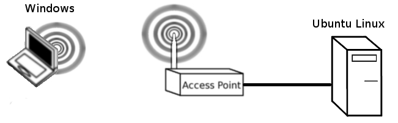

```
 ____            __                                           
|  _ \ ___ _ __ / _| ___  _ __ _ __ ___   __ _ _ __   ___ ___ 
| |_) / _ \ '__| |_ / _ \| '__| '_ ` _ \ / _` | '_ \ / __/ _ \
|  __/  __/ |  |  _| (_) | |  | | | | | | (_| | | | | (_|  __/
|_|   \___|_|  |_|  \___/|_|  |_| |_| |_|\__,_|_| |_|\___\___|
                                                              
 _____            _             
|_   _|   _ _ __ (_)_ __   __ _ 
  | || | | | '_ \| | '_ \ / _` |
  | || |_| | | | | | | | | (_| |
  |_| \__,_|_| |_|_|_| |_|\__, |
                          |___/ 
```
In this lab, we will experiment with different 802.11 options to discover their effect on performance. We will also get a feel for the real world performance of wireless links and how this compares with the labels that we see on products. Think carefully about what you have learned in lectures and the reasons why we may experience different levels of performance in the lab environment.

## Initial Setup ##

You will need to complete this lab in pairs. Start by clearing the settings on your AP: Administration->Factory-Defaults. Then connect a desktop to the wired side of your AP and connect another wirelessly. Ensure that you have end-to-end connectivity by pinging from your wireless client to your PC connected to the access point.



### Computers/lab specific setup ###

Currently the machines that we use in the labs are Virtual machines that sit within the Standard Operating Environment (SOE) Windows host. For these labs, you should use the Ubuntu OR Windows VM and make sure that your virtual network adaptor is in bridged mode. By being in bridged mode you will be able to obtain an IP address on the 192.168.1.x network and avoid the complications with NAT. You will likely need to make these changes in virtual box and then toggle your network interface, within the VM, down and then up. Remember unless you have an IP address on the 192.168.1.x subnet then you are going to find connectivity in this lab to be difficult. 

### Install Apache Web Server ###

On the Ubuntu Linux machine, make sure you have an internet connection, then install apache2

	sudo apt update
	sudo apt install apache2

Then create a large 1000MB file:

	dd if#/dev/zero of#output.dat  bs#1000M  count#1

Then move it into the web directory, and name it to test.

	sudo cp output.dat /var/www/html/test

Determine the IP address that the WiFi AP has given your machine with an:

	ifconfig

Hint: the address that you are looking for should be on the 192.168.1.0/24 subnet.

### Windows Client Configuration ###

Use the onboard wireless for the windows computers. You should be able to connect to your AP and point a web browser at the IP address of your web server. For example, you should be able to type:

	192.168.1.x/test

To download your large test file.

### Extra AP Configuration ###

Be mindful that if you do not communicate on a unique frequency, then you will be sharing the airtime with other users. Do your best to find a unique frequency and turn the power down to 10dBm, found under Wireless->Basic-Settings->Advanced-Settings. Be aware that your AP has a 5 GHz radio and a 2.4 GHz radio. Turn off the radio for whichever frequency you do not intend to use. If you are unsure about how to do this, make sure you ask.

## Experiment ##

Write your results on the whiteboard at the front. Remember to record in Mb/s (Megabits/s) rather than MB/s (MegaBytes/s). Fill out the following template. 

>https://docs.google.com/spreadsheets/d/1LB5mppPlwfql4l-LpaYYXcK2HdYavxoRVL5nGoLRxrs/edit?usp#sharing

You should copy the template onto another sheet so that all students can see other group's results on our shared google sheets template

### 2.4 GHz Speeds ###

* Turn off the 5GHz radio (wireless network Mode # Disabled) and transfer the large file from the web server to the wireless client. What was your speed? Was it more or less, than you expected? Why? 
* Rate limit your AP to 802.11b/g mixed. Re-run the test. What was your speed? Was it more, or less than you expected? Why?
* Rate limit your AP to 802.11b only. Re-run the test. What was your speed? Was it more, or less than you expected? Why?

### 5 GHz Speeds ###

* Switch off your 2.4 GHz radio and switch on your 5 GHz radio. 
* Pick a unique channel and ensure that you are operating with a 40 MHz channel. Transfer a large file. What was your speed? Was it more, or less than you expected? Why?
* Change the AP to only allow a 20 MHz channel. What was your speed? Was it more, or less than you expected? Why?
* Rate limit your AP to 802.11a-only. Re-run the test. What was your speed? Was it more, or less than you expected? Why?

### RTS/CTS Messaging ###

* Return your 5 GHz radio settings to normal, but still use the 5GHz radio for this test. Then turn on RTS/CTS on both the AP and Client.
* Transfer a big file from your web server to the wireless client. What was your speed? Was it more, or less than you expected? Why? 
* What is the purpose of RTS/CTS? Why is RTS/CTS generally considered ineffective in a BSS environment?

### Play ###

* Experiment! Which collection of settings gives you the best single-user performance in this scenario. Are your single user enhancements likely to yield the best throughput for all?

