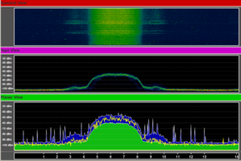
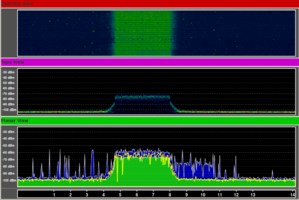

```
__     ___               _               _   _            ____  _           
\ \   / (_) _____      _(_)_ __   __ _  | |_| |__   ___  |  _ \| |__  _   _ 
 \ \ / /| |/ _ \ \ /\ / / | '_ \ / _` | | __| '_ \ / _ \ | |_) | '_ \| | | |
  \ V / | |  __/\ V  V /| | | | | (_| | | |_| | | |  __/ |  __/| | | | |_| |
   \_/  |_|\___| \_/\_/ |_|_| |_|\__, |  \__|_| |_|\___| |_|   |_| |_|\__, |
                                 |___/                                |___/ 
           _              __        ___ ____              
 _   _ ___(_)_ __   __ _  \ \      / (_) ___| _ __  _   _ 
| | | / __| | '_ \ / _` |  \ \ /\ / /| \___ \| '_ \| | | |
| |_| \__ \ | | | | (_| |   \ V  V / | |___) | |_) | |_| |
 \__,_|___/_|_| |_|\__, |    \_/\_/  |_|____/| .__/ \__, |
                   |___/                     |_|    |___/ 
```

In this lab we are going to use a product called Wi-Spy to investigate wireless physical layers including frequency, channels and modulation. This lab aims to improve your understanding of the RF spectrum and the wireless physical layer. In addition, we should also get a good idea about frequency use with respect to time and shared nature of the physical medium. You will need to use the latest Ubuntu image with the WiSpy to detect energy on the spectrum.

### Pre-Lab Questions ###

* What do the diagrams represent?
* How wide is each channel in the 2.4 GHz ISM band?
* How wide is the spacing between the centre frequency of each channel?


## Restore Factory defaults ##

At the beginning of every lab you should restore factory defaults to remove the previous groups settings. To do this, Administration->Factory Defaults->Yes, apply, ok.

## Install Wi-Spy Inssider on Linux ##

Install the appropriate tools. Firstly:

	sudo apt update

To update the links to the online repository. Then:

	sudo apt install git
	sudo apt install libusb-dev libgtk2.0-dev

Get the latest version of the code.

	git clone https://www.kismetwireless.net/git/spectools.git 

Move into the directory.

	cd spectools

Then build the software from source

	./configure
	make 
	sudo make install
	sudo spectool_gtk

## Share a file between PCs ##

In this section, we will be visualising WiFi or 802.11 spectrum use. To do this, we need to generate traffic.

Configure a file share. If you have trouble with this, take a look at Basic AP Configuration - Transfer a large file between the two PCs. The planar view and density view under 2d are both effective visualisations.

Draw the amplitude in 2D view while transmitting

When there are few transmissions, what does the wireless RF spectrum look like? How does it change when there is a large amount of wireless traffic?

Lock the AP to 802.11g only and download a large file between the two PCs Draw the amplitude in 2D view while transmitting

From the Density view, you can see the amplitude. The waterfall view provides the ability to see energy over time. Think about how you might tell the difference between an access point that is busy from an access point that is physically nearby.

In 802.11n, one of the ways they have tried to increase speeds is by using 40 MHz channels. This allows a much larger amount of data to be simultaneously transmitted. Try capturing the RF transmissions of an 802.11n device using 40 MHz channels. Can you think of any problems with using 40 MHz channels?

### DSSS spectral use ###



### OFDM spectral use ###



### Mobile Usage ###

Put your mobile next to the Wi-Spy device and make a call to your lab partner. Can you notice a change in the graphs? Why/why not?

### Bluetooth ###

Try setting up a bluetooth network between phones and transferring some files. Is frequency hopping evident/visible?

## Install inSSIDer on Windows ##

Download and install [inSSIDer](http://inssider.software.informer.com/2.1/) on a Windows computer. With a wireless adaptor plugged in, run the program and examine the resulting output. Think about the difference between using a wireless card with inSSIDer and a spectrum analyser, such as the Wi-Spy.

* What are the benefits of each tool?
* If an additional eduroam AP was requested for this lab, what channel would you deploy it on?

