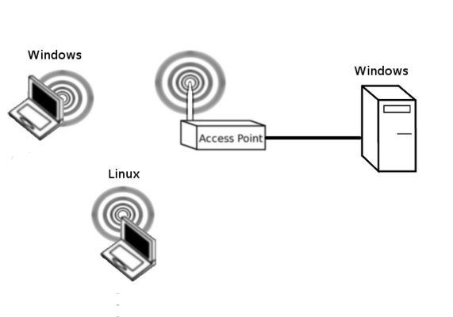

```
__        ______   _    
\ \      / /  _ \ / \   
 \ \ /\ / /| |_) / _ \  
  \ V  V / |  __/ ___ \ 
   \_/\_/  |_| /_/   \_\
                        
```

In this lab, we will demonstrate the vulnerabilities with WPA. These vulnerabilities are evident in both WPA (TKIP) and WPA2 (CCMP) modes, but not WPA3. It is hoped that it will provide you with:

* An accurate idea of the vulnerabilities in WPA 
* A good idea of how to securely implement WPA

At the start of every lab you should restore factory defaults. To do this, please follow the [device resetting](../Wireless/device_resetting.md) procedures. 

 <p style="text-align:center; font-style:italic;">Please restore factory defaults using only the web browser</p>

## Configure WPA ##

Our first task is to configure WPA over the wireless network. Ensure that the wireless Windows PC can Ping the Wired PC. Refer to Basic AP Configuration if you need to. Please ensure that you keep the username as root and the password as admin. Use the WPA password: charlie12. Unlike the previous WEP cracking lab where we could pick any hex key, we must use a simple predictable password. When cracking WEP we were identifying the key based on a series of statistical attacks. Use **WPA2 Personal and TKIP+AES**.

Ensure that the wireless Windows PC can Ping the Wired PC. Refer to [WPA setion in Broadband_CPE_Scenarios](./broadband_cpe_senarios.md#wpa) if you need to. **Additionally, turn off the 5GHz radio and change the network mode on the 2.4 GHz radio to 802.11b/g Mixed. Remember that there are two radios, and you will need to set the 5GHz radio mode to disabled.**

In this WPA cracking lab, we are brute-forcing the key. We are only able to identify the key if it is part of our password database. The more complex the key, the less likely it will appear in a password database. An alternative way of looking at this, the longer and more complex the key, the longer and more complex our password database must be. This will also increase the amount of computation required to break the key.



## Aircrack and monitor mode ##

Follow the instructions here to put the Alpha USB Wifi adapter in monitor mode: [Alpha_USB_in_monitor_mode](./monitor_mode.md)

## Discover Network ##

We need to discover the channel and BSSID of our target network. Start Wireshark with:

	sudo wireshark

Put the interface in monitor mode and use wireshark to discover the bssid of the target. Copy this value to a text file for later.

### Collecting the handshake in Wireshark ###

Try capturing the encrypted handshake in wireshark. packets? Save the pcap on the Desktop.

### Using Aerodump ###

Another alternative is using airodump. Type:

	sudo iwconfig [interface_name] channel [x]

### Collecting the authentication handshake with airodump-ng ###

The purpose of this step is to run airodump-ng to capture the 4-way authentication handshake for the target AP. Enter:

	sudo airodump-ng -c [the_channel] --bssid [the_BSSID] -w psk [interface_name]

On your legitimately connected wireless machine, try disconnecting and reconnecting a few times.

## Crack the PSK ##

We are going to compare the four-way authentication handshake and compare it with a password list. Download a password list from the Internet. 

Note, if Kali Linux drops its LAN connection, you can bring it up with a:

 	sudo dhclient eth0

You can download a password list with:

<!-- wget https://github.com/danielmiessler/SecLists/raw/master/Passwords/Common-Credentials/10-million-password-list-top-1000000.txt -->
	wget https://raw.githubusercontent.com/danielmiessler/SecLists/refs/heads/master/Passwords/Common-Credentials/Pwdb_top-1000000.txt

AND

<!-- wget https://raw.githubusercontent.com/danielmiessler/SecLists/master/Passwords/xato-net-10-million-passwords-1000000.txt -->
	wget https://raw.githubusercontent.com/danielmiessler/SecLists/refs/heads/master/Passwords/Common-Credentials/xato-net-10-million-passwords-1000000.txt

For a larger list you can try: 

	wget https://github.com/brannondorsey/naive-hashcat/releases/download/data/rockyou.txt

The password list is generated from lists of leaked passwords. This list contains the most frequently used passwords. Some of the passwords in the list are offensive, please don't go looking if you are easily offended. If you ever discover your personal passwords in one of these password lists then you must change it immediately!

Crack the key with the following command:

	aircrack-ng filename_of_packets -w [full_path_of_password.list]

## Restore Factory defaults 

At the end of every lab you should restore factory defaults. To do this, please follow the [device resetting](../Wireless/device_resetting.md) procedures. 
